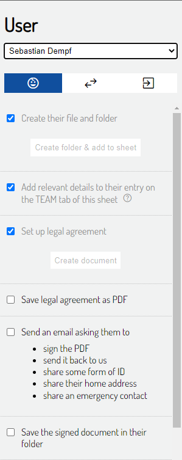

# Apps Script JML Extension

This project extends Google Sheets by adding a sidebar from which Joiners, Movers, and Leavers procedures can be handled.

## Setup

To set this up, initialize a new container bound Apps Script project from within Google Sheets. Add the files in the [src](/src) repository (with .js files becoming .gs files). Alternatively, use [Clasp](https://github.com/google/clasp).

## Configuration

By default the app comes with three procedures: Joiners, Movers, and Leavers. Specify the steps included in each by modifying [Config.js](src/Config.js). Every item of the array that is returned by getProcedureConfig() corresponds to a step in the procedure. Possible specifications for items include:

| key         | type                                 | mandatory | function                                                                                                                      |
| ----------- | ------------------------------------ | --------- | ----------------------------------------------------------------------------------------------------------------------------- |
| name        | string                               | ✅        | Display text for this step   _e.g. "Create their file and folder"_                                                        |
| list        | string [ ]                           | ❌        | A bullet point list                                                                                                           |
| action      | {text: string,  callback: string} | ❌        | A button that will launch an apps script function   Requires 'text' as the button text and 'callback' as the function name |
| links       | string [ ]                           | ❌        | A list of URLs                                                                                                                |
| description | string                               | ❌        | An optional description that can be toggled by clicking a (?) icon                                                            |

Once installed and configured, call resetUserStateFile() inside [JSONController](src/JSONController.js) once.

## Usage

The project addds a new UI element to the sheet. When called, a sidebar appears displaying a dropdown of all users in the workspace (admin privileges may be necessary). Once a user has been selected, their current state inside each JML procedure is read in and displayed in the sidebar. Steps can be checked an unchecked, descriptions can be toggled, and apps script function can be called by clicking the corresponding button.
